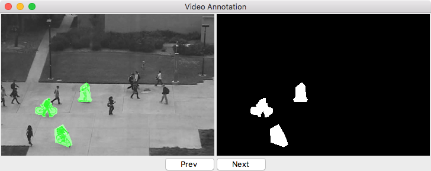

# video-annotation
A simple video annotation software

#Run#
Set the variables imFolder and gtFolder from the video_annotation file.

#Commands#
* <- and -> : next and prev image
* \+ and - : zoom in and out
* d : annotation delete toggle
